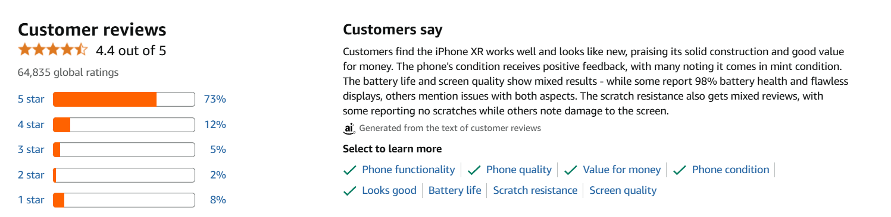

# iPhone XR Customer Feedback Analysis & Product Health Summary

Analyzed 4700+ customer reviews from Amazon.com for Apple iPhone XR (64GB) - Black from November 2018 to April 2020.

This summary provides a consolidated view of customer satisfaction, highlighting key product strengths, weaknesses, and discussion themes to inform strategic decisions for product, marketing, and service teams.

**Executive Summary:** The iPhone XR is a highly successful product with strong customer satisfaction, driven primarily by its excellent camera and battery life. The most significant opportunity for improvement lies not in the product itself, but in streamlining the after-sales service and returns process, which is the primary source of customer frustration.

### 1\. Key Performance Indicators (At a Glance)

These core metrics provide a high-level summary of customer sentiment.

| Metric | Value | Insight |
| --- | --- | --- |
| Overall Average Rating |4.4| Indicates strong overall product satisfaction. |
| Average Sentiment Score |+0.43| The language used in reviews is predominantly positive. |
| Total Reviews Analyzed |4,700+| A substantial dataset ensuring relevant findings. |

### 2\. Strengths vs. Weaknesses: Aspect Sentiment Analysis

This chart ranks key product aspects based on the average sentiment of the language used when customers discuss them. It provides a clear, data-driven priority list.

**Key Insights:**

*   **Clear Strengths:** The **Camera** and **Battery** are the most praised features, generating the strongest positive emotional response and driving customer delight.
*   **Primary Weakness:** The **Service** experience (including returns, delivery, and support) is the most significant pain point, showing a drastically lower sentiment score compared to the physical product features.

### 3\. Key Topics Tracker: What Customers Are Talking About

This section distills the core themes from the most helpful positive and negative reviews, revealing what matters most to users.

| Key Positives | Key Negatives |
| --- | --- |
| 1. Superior Camera & Battery Life: The "make-or-break" features that define the premium experience. | 1. Service & Returns Process: Frustrations with after-sales support and replacements. |
| 2. Excellent Value for Money: Customers feel they made a smart purchase, getting premium features at a good price point. | 2. Hardware & Component Failure: Issues with key parts like the battery, charger, or speaker not working. |
| 3. High-Quality Performance & Display: The overall speed, Face ID, and screen quality are consistently praised. | 3. Defective on Arrival: Receiving a faulty unit right out of the box, leading to a poor initial experience. |

### 4\. Customer Satisfaction Over Time

This section tracks the average monthly rating, helping to identify trends and the impact of external events.

Key Insight:

Customer satisfaction has remained consistently high and stable over the product's lifecycle. The significant dip observed in April 2020 was a statistical anomaly caused by an extremely low volume of reviews during that period and does not represent a genuine decline in product quality.

### 5\. AI-Driven Insights

#### Key AI-Generated Synopsis:

*   **Overall Experience:** A sophisticated but bulky design, with the lack of an OLED screen being a notable drawback for users.
*   **Camera & Design:** The camera is a key strength in good lighting, but its low-light performance is average and the phone is considered heavy.
*   **Product Defects:** Receiving defective units, especially with camera failures, is a major source of customer frustration.
*   **Performance & Value:** Praised for fast and smooth performance, though the camera's lack of a dedicated night mode is a noted weakness.

### Verification

The customer review summary section on Amazon can also verify the above observations:

